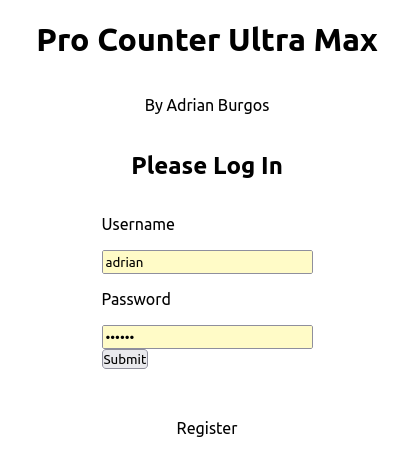

# RESTfull web app using React(frontend) and Go(backend)

This is a RESTfull SPA. 

## Table of contents

- [Overview](#overview)
  - [Specs](#specs)
  - [Screenshot](#screenshot)
  - [Link](#link)
- [My process](#my-process)
  - [Built with](#built-with)
- [Author](#author)

## Overview

### Specs

- The server runs on port 3001 if evironment variable "GO_ENV" is set to "development" otherwise it takes port number set in "PORT" environment variable

### Screenshot

### Link

- Live Site URL: [https://countersgo.herokuapp.com/](https://countersgo.herokuapp.com/)

## My process

### Built with

- React JS
- TailwidCSS
- Go(Golang)
- SQL

## Author
- Portfolio - [Adrian Burgos](https://adrianburgoscolas.github.io/portfolio/)
- Exercism - [@adriangopher](https://exercism.org/profiles/adriangopher)
- freeCodeCamp - [Adrian Burgos](https://www.freecodecamp.org/fcce3ec214d-b0f9-4ddc-b526-34aea3d1e4a3)
- Frontend Mentor - [@adrianburgoscolas](https://www.frontendmentor.io/profile/adrianburgoscolas)
- Linkedin - [linkedin.com/in/adrian-burgos-1776a6144](https://www.linkedin.com/in/adrian-burgos-1776a6144/)
